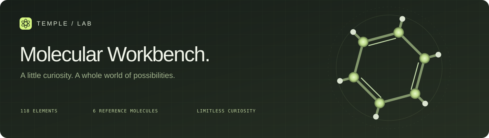
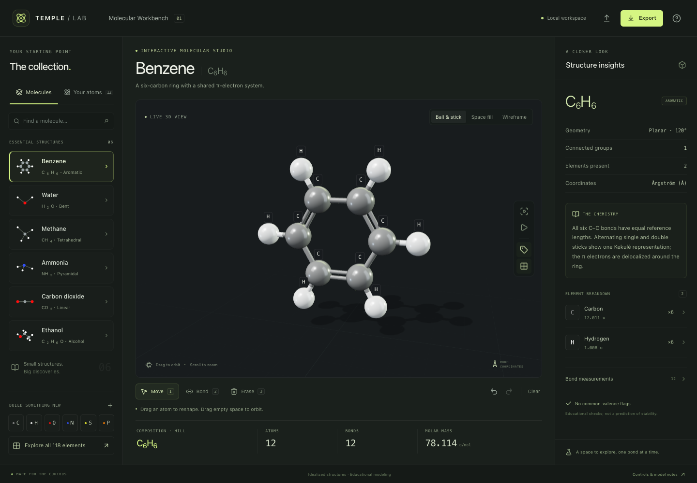
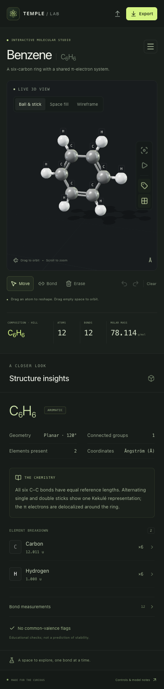
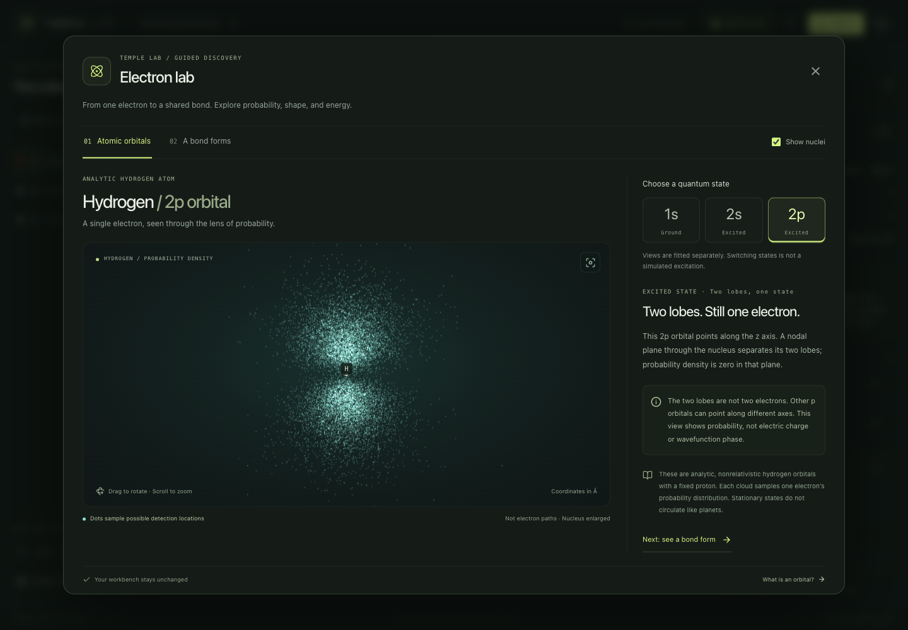
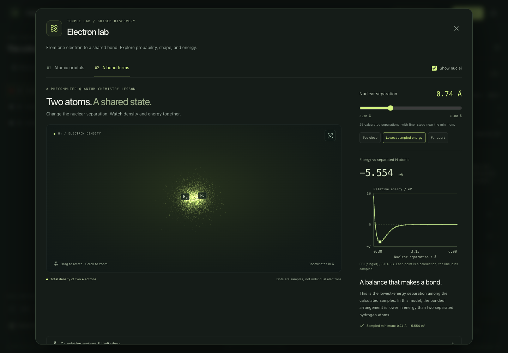
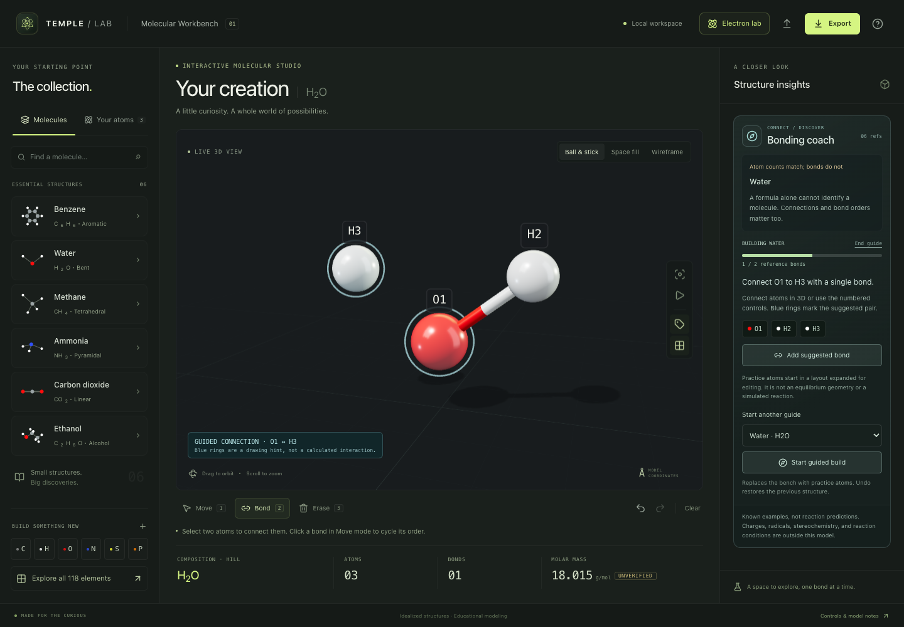

<div align="center">
  
  <h1>Temple Molecular Workbench</h1>
  <p><strong>A space to explore, one bond at a time.</strong></p>
  <p>An interactive 3D chemistry studio for the curious.<br />Explore reference molecules, build structures, and see chemistry take shape.</p>
  <p><em>Created by The Temple of Two in collaboration with Astra (OpenAI Codex).</em></p>
  <p>
    <a href="https://github.com/templetwo/temple-molecular-workbench/actions/workflows/ci.yml"></a>
    <a href="LICENSE"></a>
    <a href="package.json"></a>
    <a href="src/components/Bench3D.tsx"></a>
    <a href="tsconfig.app.json"></a>
  </p>
  <p><a href="#get-started">Get started</a> · <a href="#controls">Controls</a> · <a href="#the-chemistry">The chemistry</a> · <a href="CONTRIBUTING.md">Contribute</a></p>
</div>



<details>
<summary>Designed for smaller screens, too</summary>
<p align="center"></p>
</details>

## A workbench for discovery

Start with benzene's ring, rotate methane's tetrahedron, or build a structure from the periodic table. A focused studio layout keeps the collection, the molecule, and its properties together.

- **Six reference molecules.** Benzene, water, methane, ammonia, carbon dioxide, and ethanol, with geometry notes and source-backed coordinates.
- **118 elements to explore.** Search by name, symbol, or atomic number; filter categories; inspect element properties with an explicit scientific status on each field.
- **An editable 3D bench.** Move atoms, connect bonds, cycle single/double/triple bonds, and switch between ball-and-stick, illustrative space-fill, and wireframe views.
- **A bonding coach.** Identify matching reference bond patterns, see inventory-based possibilities, or build a known molecule with numbered atoms, 3D hints, and undoable steps. Recognition is not reaction prediction.
- **An Electron Lab.** Explore hydrogen 1s, 2s, and 2p probability clouds, then bring two hydrogen nuclei together and compare their calculated electron density and energy. Your editable workspace stays unchanged.
- **Structure insights.** Formula, molar mass, composition, connected fragments, bond distances, and advisory checks for common neutral valences.
- **Room to experiment.** Undo and redo up to 50 structural edits, including atom drags, imported molecules, preset changes, and a cleared bench.
- **Your workspace, in your browser.** Local saving when browser storage is available, plus portable JSON import and export. No account or molecular-data backend is required.

## Beyond the ball-and-stick model

Open **Electron lab** to see where an electron could be detected—not a tiny planet on an orbit. Explore hydrogen's 1s, 2s, and 2p states, then connect electron density with a calculated H₂ energy curve. Each lesson states what is calculated, what the dots mean, and where the model stops.



<details>
<summary>See molecular hydrogen through density and energy</summary>



The curve uses precomputed FCI/STO-3G results; moving the slider does not simulate a reaction. [Read the scientific methods and limitations](docs/ELECTRON-SCIENCE.md).

</details>

## Get started

### One click on macOS

Download the [Apple Silicon Mac bundle](https://github.com/templetwo/temple-molecular-workbench/releases/latest/download/Temple-Lab-macOS-arm64.zip), unzip it, and double-click **Temple Lab.app**. The bundle includes the simulator and its runtime. No terminal commands, Node installation, npm installation, or internet connection are needed to use the bundled workbench.

The current bundle is for Apple Silicon Macs running macOS 11 or later. It is not yet Developer ID signed or notarized; downloaded copies may require approval in macOS Privacy & Security. See [launcher notes](docs/LAUNCHER.md) for details and source-build instructions.

### Run from source

Use **Node.js 22.12 or newer** and npm. The 3D view requires a browser with WebGL 2 support.

```sh
git clone https://github.com/templetwo/temple-molecular-workbench.git
cd temple-molecular-workbench
npm ci
npm run dev
```

Open the address printed by Vite, normally **http://127.0.0.1:5173**. Choose a molecule from the collection or open the element library to add an atom.

| Command                 | Purpose                                                       |
| ----------------------- | ------------------------------------------------------------- |
| `npm run dev`           | Start the local development server                            |
| `npm test`              | Run chemistry, workspace-state, and launcher regression tests |
| `npm run lint`          | Check the source with ESLint                                  |
| `npm run build`         | Type-check and produce the static site in `dist/`             |
| `npm run preview`       | Preview the production build locally                          |
| `npm run check`         | Run regression tests, lint, and the production build          |
| `npm run test:e2e`      | Verify real browser workflows against a running local server  |
| `npm run test:bonding`  | Check reference recognition and guided bonding workflows      |
| `npm run test:packaged` | Verify the offline production app at `127.0.0.1:5178`         |

For browser tests, start `npm run dev` in another terminal. The test runner uses locally installed Google Chrome when available; otherwise run `npx playwright install chromium` once. Failure screenshots are written to `test-results/`. To refresh the workbench screenshots, use `node tests/browser.mjs --screenshot`; Electron Lab captures use `node tests/electrons-browser.mjs --screenshot`. The Electron Lab suite also accepts `TEST_BASE_URL` for checking a production build without source imports.

Use `npm start` to open an existing production build, `npm run bundle:mac` to create the app and ZIP for the current Mac architecture, and `npm run icons` to regenerate the PNG logos and native icon from the SVG artwork.

## Controls

| Action                             | Input                                                           |
| ---------------------------------- | --------------------------------------------------------------- |
| Orbit the molecule                 | Drag empty space                                                |
| Zoom                               | Scroll the wheel                                                |
| Move an atom                       | Select **Move**, then drag the atom                             |
| Connect atoms                      | Select **Bond**, then select two atoms                          |
| Change bond order                  | Click a bond in Move mode, or use the bond-measurement controls |
| Remove an atom or bond             | Select **Erase**, then select the object                        |
| Switch Move / Bond / Erase         | `1` / `2` / `3`                                                 |
| Open the element library           | `T`                                                             |
| Fit the molecule to the viewport   | `F`                                                             |
| Undo                               | `⌘/Ctrl Z`                                                      |
| Redo                               | `⌘/Ctrl Shift Z` or `⌘/Ctrl Y`                                  |
| Remove the selected atom           | `Delete` or `Backspace`                                         |
| Clear selection and return to Move | `Esc`                                                           |

The viewport also has controls for automatic rotation, labels, and the reference grid. Keyboard editing shortcuts pause while typing or using a dialog. Atom dragging follows a plane facing the camera; orbit first to edit from another direction.

For keyboard editing, open **Your atoms** and choose an atom. Its X/Y/Z fields apply on Enter or when leaving the field. In Bond or Erase mode, the same atom-list buttons connect or remove atoms.

Open **Electron lab** in the header for two separate learning views. Select a hydrogen orbital, drag its cloud to rotate, or switch to **H₂ bonding** and move the nuclear-separation slider. The slider supports arrow keys and Home/End. **Show nuclei** toggles enlarged reference markers; Escape closes the lab and returns to the workbench. The orbital descriptions and bond-energy curve remain usable without WebGL.

## The chemistry

The six presets use educational reference geometries derived from the **NIST Computational Chemistry Comparison and Benchmark Database (CCCBDB, SRD 101)**. Coordinates are translated or rotated for presentation without changing their relative distances. One model coordinate unit is **one ångström (Å)**.

| Molecule       | Formula | Reference geometry                                           | Source                                                           |
| -------------- | ------- | ------------------------------------------------------------ | ---------------------------------------------------------------- |
| Benzene        | C₆H₆    | Planar ring; 120°; equal 1.397 Å C–C edges                   | [NIST](https://cccbdb.nist.gov/exp2x.asp?casno=71432&charge=0)   |
| Water          | H₂O     | Bent; approximately 104.5°                                   | [NIST](https://cccbdb.nist.gov/exp2x.asp?casno=7732185&charge=0) |
| Methane        | CH₄     | Tetrahedral; approximately 109.5°                            | [NIST](https://cccbdb.nist.gov/exp2x.asp?casno=74828&charge=0)   |
| Ammonia        | NH₃     | Trigonal pyramidal; 106.67° in this reference                | [NIST](https://cccbdb.nist.gov/exp2x.asp?casno=7664417&charge=0) |
| Carbon dioxide | CO₂     | Linear; 180°                                                 | [NIST](https://cccbdb.nist.gov/exp2x.asp?casno=124389&charge=0)  |
| Ethanol        | C₂H₆O   | A reference conformer with approximately tetrahedral carbons | [NIST](https://cccbdb.nist.gov/exp2x.asp?casno=64175&charge=0)   |

Benzene's alternating bond sticks depict one Kekulé representation. Its π electrons are delocalized; the preset uses equal ring-edge lengths. See the [IUPAC definition of aromaticity](https://goldbook.iupac.org/terms/view/A00442).

### Model boundaries

The **editable molecular workbench** does not perform energy minimization, molecular dynamics, reaction prediction, or quantum calculations. Moving atoms changes the drawing; it does not find an equilibrium geometry.

The separate **Electron Lab** uses analytic nonrelativistic hydrogen orbitals and a precomputed H₂ lesson: 25 fixed nuclear separations calculated with PySCF 2.14.0, singlet FCI, and the minimal STO-3G basis. Its energy zero is two separated neutral H atoms in that same basis, and total energies include nuclear repulsion. The lowest sampled point is 0.74 Å at approximately −5.554392 eV relative to that reference—not an experimental dissociation energy or an optimized geometry. Dots sample probability or electron density; they are not electron trajectories or simultaneous individual electrons. Switching states or moving the slider is not a simulated excitation or reaction. See [the scientific methods, limitations, and reproducible generator](docs/ELECTRON-SCIENCE.md).

Atom radii, bond thicknesses, and the space-fill display are visual conventions. Electron-shell and lattice views are schematic. Bond distances measure the current coordinates. Common-valence notes are limited to selected neutral covalent atoms and do not determine chemical stability, formal charge, aromaticity, or metal coordination.

Element properties in [`src/data/elements.ts`](src/data/elements.ts) are compiled from the inherited dump plus explicit overlays. Each displayed field has a scientific status (measured/evaluated, calculated/predicted, unverified, or unavailable) separate from provenance. Unverified values are inherited and are not reference measurements. Unsupported numbers are withheld rather than guessed. Helium’s mass cites [CIAAW](https://ciaaw.org/helium.htm). Hassium’s inherited melting point and density are withheld because the [RSC table](https://periodic-table.rsc.org/element/108/hassium) lists them as unknown. Carbon density is withheld until an allotrope is specified. Molar-mass totals inherit the weakest mass status in the structure. See [element data notes](docs/ELEMENT-DATA.md). Passing the automated suites does not establish reference-data accuracy.

Custom formulas use Hill ordering and total the entire bench, including disconnected fragments. Reference cards retain familiar formulas such as NH₃; the same custom composition is H₃N in Hill order.

## Try guided bonding

In **Structure insights → Bonding coach**, choose Water and select **Start guided build**. Connect the highlighted atoms in 3D, use the numbered controls, or add the suggested bond. The coach explains matching connectivity, missing connections, and bond orders. Starting a guide replaces the bench; Undo restores it. Loading reference geometry is a separate action.



See [bonding methods and boundaries](docs/BONDING-GUIDE.md). Atom inventories alone do not predict which substances will react or what products they will form.

## Workspace files

**Export** creates a `.json` file that can be imported to continue later. Imports are validated before the current structure changes. The format uses `kind: "molecule-studio"`, `schemaVersion: 1`, and `units: "angstrom"`; it contains atoms, bonds, preset identity when applicable, and display preferences.

A workspace supports **128 atoms**, **384 bond records**, and coordinates within **±100 Å** on each axis. Import files are limited to **256 KB**. Local saving uses the browser's storage for the current site; clearing browser data removes that local copy. Export provides a copy you control. Structural history lasts for the current session; display preferences are saved independently.

## Inside the project

| Area                                                               | Responsibility                                                                     |
| ------------------------------------------------------------------ | ---------------------------------------------------------------------------------- |
| [`src/App.tsx`](src/App.tsx)                                       | Studio layout, collection, inspector, commands, import/export UI                   |
| [`src/components/Bench3D.tsx`](src/components/Bench3D.tsx)         | Three.js scene, camera, representations, pointer interaction, WebGL fallback       |
| [`src/state/store.ts`](src/state/store.ts)                         | Zustand state, history, validation, local persistence, formula and mass helpers    |
| [`src/data/molecules.ts`](src/data/molecules.ts)                   | Reference molecules, lesson text, source links                                     |
| [`src/data/elements.ts`](src/data/elements.ts)                     | Inherited dump plus compiled element records with status and provenance            |
| [`src/data/element-properties.ts`](src/data/element-properties.ts) | Status/provenance types, presentation rules, and catalog compile                   |
| [`docs/ELEMENT-DATA.md`](docs/ELEMENT-DATA.md)                     | Element-data methods, first-cut overlays, and remaining audit work                 |
| [`src/lib/chemistry.ts`](src/lib/chemistry.ts)                     | Fragment analysis and advisory valence checks                                      |
| [`src/components/ElectronLab.tsx`](src/components/ElectronLab.tsx) | Guided orbital and H₂ bonding lessons, energy curve, and accessible controls       |
| [`src/lib/electrons.ts`](src/lib/electrons.ts)                     | Analytic orbital densities and bounded sampling of the calculated H₂ density       |
| [`src/data/hydrogen-bond.json`](src/data/hydrogen-bond.json)       | Computed H₂ energies, density matrices, scientific provenance, and validation      |
| [`tests/chemistry.test.ts`](tests/chemistry.test.ts)               | Reference geometry, graph validation, history, and persistence regression coverage |

Built with React 19, TypeScript, Three.js, React Three Fiber, Drei, Zustand, Radix UI, and Vite. The production output is a static site.

## Contribute

Chemistry corrections, focused interaction improvements, and accessible learning tools are welcome. Start with [the contribution guide](CONTRIBUTING.md) and [the review and roadmap](docs/REVIEW.md). Please include an authoritative source when changing scientific data or claims.

Created by The Temple of Two in collaboration with Astra (OpenAI Codex). Licensed under the [MIT License](LICENSE). © 2026 The Temple of Two.

The bundled Node.js runtime retains its own license and third-party notices. The [logo kit](docs/BRANDING.md) includes editable SVG artwork and PNG exports.
